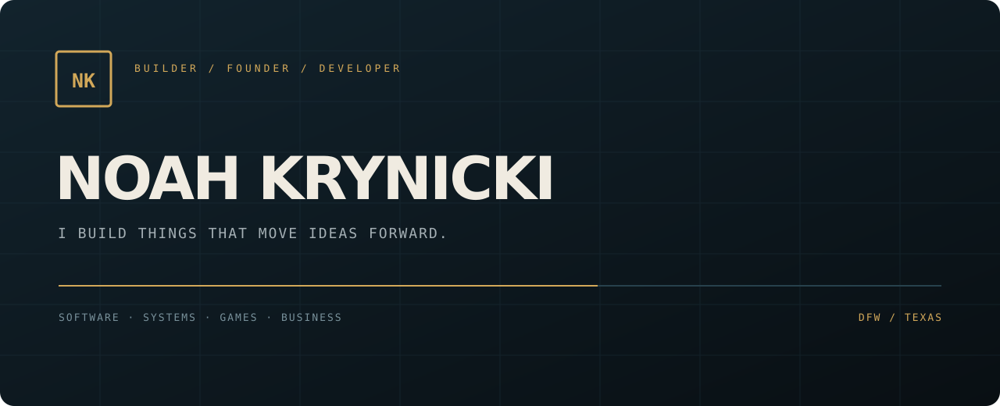

# Noah Krynicki — Portfolio

[](https://github.com/thacanadian/portfolio/actions/workflows/verify.yml)



Personal portfolio for Noah Krynicki, a DFW-based builder and founder working across software, systems, sales, operations, and zero-to-one business building.

## Live site

**Portfolio:** https://noahkrynicki-portfolio-noahwkry-5549s-projects.vercel.app

The site highlights selected projects, a deeper Apex Aircraft Care founder case study, practical leadership/operations experience, and direct links to public source or public-safe project documentation.

## Contact

- Email: [noahwkry@gmail.com](mailto:noahwkry@gmail.com)
- LinkedIn: [linkedin.com/in/noah-krynicki-48513b312](https://www.linkedin.com/in/noah-krynicki-48513b312/)
- GitHub: [github.com/thacanadian](https://github.com/thacanadian)

## Run locally

```bash
npm install
npm run dev
```

Then visit `http://localhost:3000`.

## Production build

```bash
npm run build
npm start
```

Built with Next.js and React. The repository is the maintainable source version of the portfolio; the production host may use an equivalent static deployment bundle for reliability.
